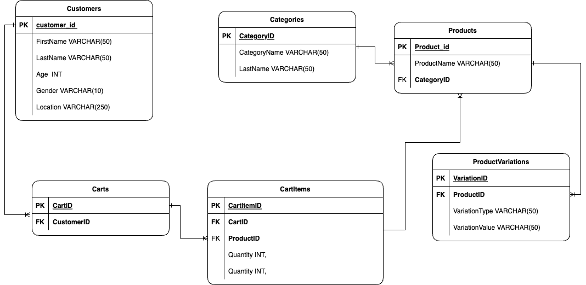

# 3.database-design

## result

I design to each table following by this.

1.Customers: Stores information about customers, including their ID, name, age, gender, and location.
2.Categories: Contains different categories of products.
3.Products: Represents individual products with a link to their respective category.
4.ProductVariations: Handles different variations of a product, such as color or size.
5.Carts: Represents individual customer shopping carts.
6.CartItems: Contains the items added to each cart, linking back to the customer and the specific product.

## ER diagram

you can see ER diagram below.

## Example Data

**Customers Table:**

| CustomerID | FirstName | LastName | Age | Gender | Location          |
| ---------- | --------- | -------- | --- | ------ | ----------------- |
| 1          | John      | Doe      | 25  | Male   | New York, USA     |
| 2          | Jane      | Smith    | 30  | Female | London, UK        |
| 3          | Bob       | Johnson  | 22  | Male   | Sydney, Australia |

**Categories Table:**

| CategoryID | CategoryName     |
| ---------- | ---------------- |
| 1          | Clothing         |
| 2          | Electronics      |
| 3          | Home and Kitchen |

**Products Table:**

| ProductID | ProductName  | CategoryID |
| --------- | ------------ | ---------- |
| 1         | T-Shirt      | 1          |
| 2         | Laptop       | 2          |
| 3         | Cookware Set | 3          |

**ProductVariations Table:**

| VariationID | ProductID | VariationType | VariationValue  |
| ----------- | --------- | ------------- | --------------- |
| 1           | 1         | Color         | Red             |
| 2           | 1         | Size          | Large           |
| 3           | 2         | Storage       | 512GB SSD       |
| 4           | 3         | Material      | Stainless Steel |

**Carts Table:**

| CartID | CustomerID |
| ------ | ---------- |
| 101    | 1          |
| 102    | 2          |
| 103    | 3          |

**CartItems Table:**

| CartItemID | CartID | ProductID | Quantity |
| ---------- | ------ | --------- | -------- |
| 1001       | 101    | 1         | 2        |
| 1002       | 102    | 2         | 1        |
| 1003       | 103    | 3         | 3        |
